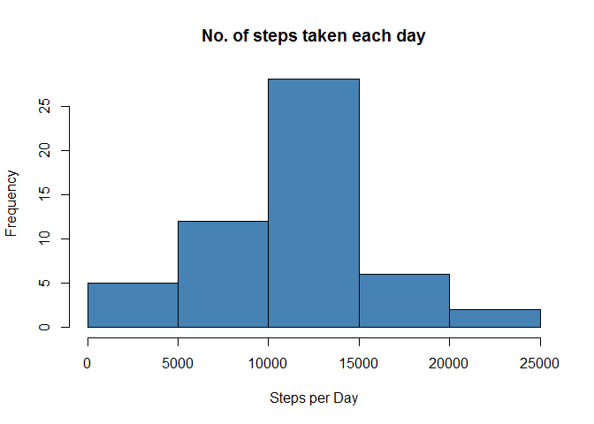
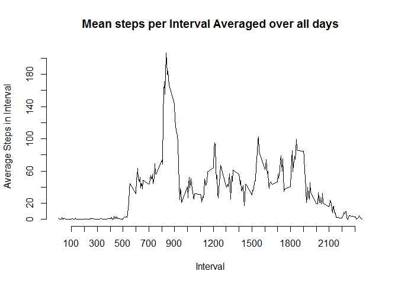
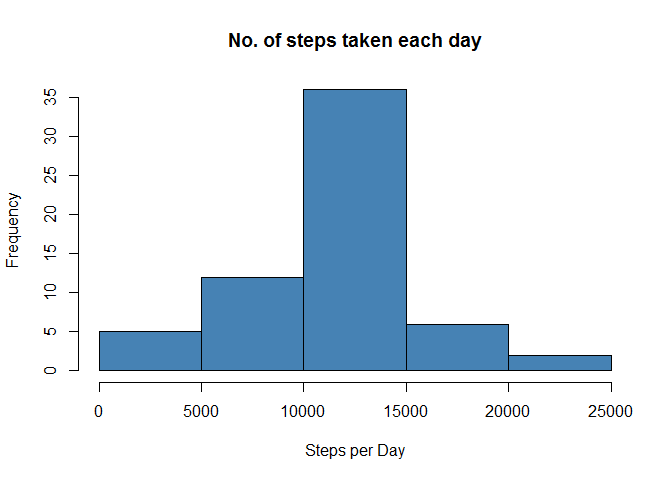
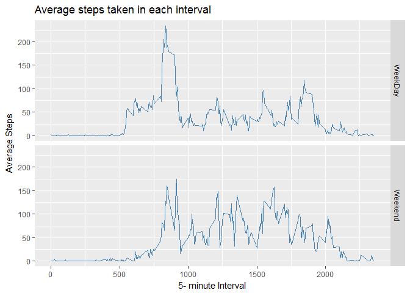

# Reproducible Research: Peer Assessment 1


## Loading and preprocessing the data

Reading Data


```r
Activity<- read.csv("activity.csv", header = TRUE)
```


## What is mean total number of steps taken per day?

Removing NA Values from Raw Data


```r
Activity_Complete<- complete.cases(Activity)
Activity_Com <- Activity[Activity_Complete, ]
```

Summarizing steps per day


```r
Steps_per_day<- aggregate(steps~date, data = Activity_Com, sum)

Steps_per_day$date<- as.Date(Steps_per_day$date)
```

Plotting Data and Finding Results


```r
hist(Steps_per_day$steps, col= "steelblue", main = "No. of steps taken each day", xlab = "Steps per Day")
```

<!-- -->

Calculating Mean and Median


```r
Mean_Steps_per_Day<- mean(Steps_per_day$steps)
Median_Steps_per_Day<- median(Steps_per_day$steps)
print(paste("Mean =",format(Mean_Steps_per_Day, 2)))
```

```
## [1] "Mean = 10766.19"
```

```r
print(paste("Median =",Median_Steps_per_Day))
```

```
## [1] "Median = 10765"
```


## What is the average daily activity pattern?
Aggregating data: Calculating mean steps per interval averaged over all days

```r
Mean_steps_Interval<- aggregate(steps~interval, data=Activity, mean)
```


Plotting Data 


```r
plot( Mean_steps_Interval$interval,Mean_steps_Interval$steps, xlab = "Interval", ylab = "Average Steps in Interval", main = "Mean steps per Interval Averaged over all days", axes = FALSE, type = "l")
axis(side = 1, at=seq(100,2300, by=100))
axis(side = 2, at=seq(0,200, by=20))
```

<!-- -->

Finding Time interval with maximum Average steps


```r
Var<- Mean_steps_Interval$interval[which(Mean_steps_Interval$steps==max(Mean_steps_Interval$steps))]

print(paste("Time interval with maximum average steps is : ",Var))
```

```
## [1] "Time interval with maximum average steps is :  835"
```


## Imputing missing values
Finding Missing Values in Activity Raw Data


```r
Missing_Values <- sum(!complete.cases(Activity))
Missing_Values
```

```
## [1] 2304
```


Mean Value averaged over all days for a time interval would be appropriate.

Imputing NA Values with mean value  

```r
Mean_steps_Interval<- aggregate(steps~interval, data=Activity, mean)

Activity_Impute<- Activity

NAIndex<- which(is.na(Activity$steps))


for(i in NAIndex){
  Activity_Impute$steps[i]<-Mean_steps_Interval$steps[ which(Activity_Impute[i,3]==Mean_steps_Interval$interval)]
}
```


Summarizing steps per day


```r
Steps_per_day<- aggregate(steps~date, data = Activity_Impute, sum)

Steps_per_day$date<- as.Date(Steps_per_day$date)
```

Plotting histogram for steps per day 

```r
hist(Steps_per_day$steps, col= "steelblue", main = "No. of steps taken each day", xlab = "Steps per Day")
```

<!-- -->


Mean and Median of Imputed data

```r
Mean_Steps_per_Day<- mean(Steps_per_day$steps)
Median_Steps_per_Day<- median(Steps_per_day$steps)
print(paste("Mean =",format(Mean_Steps_per_Day, 2)))
```

```
## [1] "Mean = 10766.19"
```

```r
print(paste("Median =",Median_Steps_per_Day))
```

```
## [1] "Median = 10766.1886792453"
```


## Are there differences in activity patterns between weekdays and weekends?
Creating a factor Variable for Weekend and Weekdays


```r
Activity$daytype<- ifelse(grepl("Sat|Sun", weekdays(as.Date(Activity$date))) == TRUE,"Weekend","WeekDay")

Activity$daytype<- as.factor(Activity$daytype)
```

Generating final panel plot(using ggplot2)


```r
Mean_steps_Interval_daytype<- aggregate(steps~interval+daytype, data=Activity, mean)

library(ggplot2)
```

```
## Warning: package 'ggplot2' was built under R version 3.4.1
```

```r
g<- ggplot(data = Mean_steps_Interval_daytype, aes(interval,steps))+geom_line(col="steelblue")+facet_grid(daytype~.)+ggtitle("Average steps taken in each interval ")+xlab("5- minute Interval")+ylab("Average Steps")

g
```

<!-- -->
